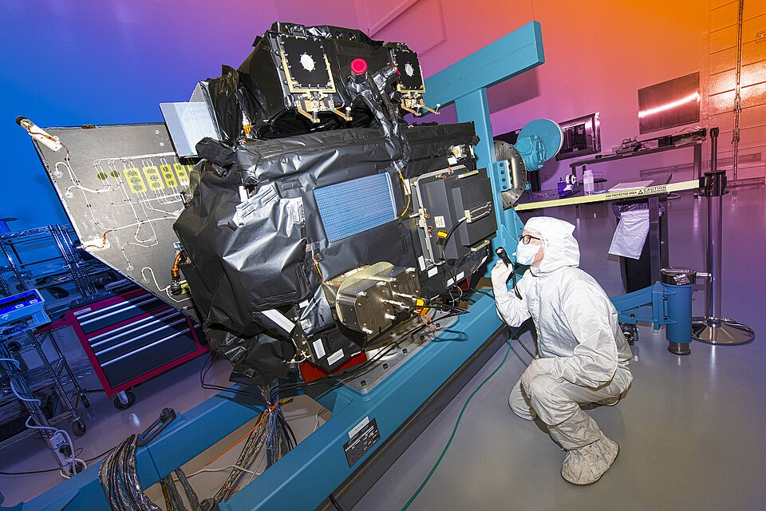

# Summary

Computational tomography is a tool for determining the internal structure of objects from a set of projections, typically taken along some regular path (e.g. circular, helical). In recent years, methods and GPU-accelerated libraries have emerged that allow for fast reconstruction from projections along more complicated paths. Most of these libraries rely on a Cartesian discretization of the object.  In planetary and solar tomography, projections are taken along an irregular spacecraft orbit of spherical bodies not well-suited to Cartesian grids.

# Statement of need

We present `TomoSphero`, a differentiable tomographic projector over spherical grids which are often used in planetary and solar tomography. 
`TomoSphero` is designed to be used as a building block in reconstruction algorithms where iterative techniques require a fast (and ideally differentiable) forward tomographic operator.

It includes common projection types such as cone-beam and parallel-beam, but is flexible enough to accommodate arbitrary projections. `TomoSphero` is implemented in PyTorch, which allows for fast projection computation on GPUs, easy integration into machine learning algorithms, and automatic differentiation for reconstruction algorithms which require access to gradients.

# State of the Field

Tomography is a method for determining the internal structure of objects from a set of measurements that penetrate into the object being measured.  These measurements (sometimes called projections or sinograms) are usually captured from a variety of locations and times which are collectively referred to as the _view geometry_. Measurements are typically modeled as

$$y = F x + \epsilon \label{lineintegration}$$

where $y$ is a collection of measurements,  $F$ is a linear projection operator (each row of this matrix is a line of sight), $x$ is the object under study, and $\epsilon$ is noise.

Tomography has found application in a vast number of domains such as medical imaging, crystallography, and remote sensing, utilizing modalities like X-ray, ultraviolet (UV), ultrasound, seismic waves, and many more.  In this paper we discuss TomoSphero, a Python library for planetary and solar tomography.

Fast tomographic reconstruction algorithms that implement explicit inversion formulas typically work only for specific view geometries (such as circular or helical view geometry) and are referred to as _filtered back projection_ (FBP) algorithms [@fbp].  However, some situations (like an orbiting spacecraft) necessitate more complicated measurement paths than are allowed by FBP-type algorithms.  For these situations requiring more flexible view geometries where an exact inverse solution is not available, _iterative reconstruction_ (IR) algorithms prevail, usually solving an optimization problem of the form

$$\hat{x} = \arg \min_c \lVert y - F M(c) \rVert_2^2 + \mathcal{R}(...) + ...$$ 

where $M$ is a parametric model for the object under construction and $\mathcal{R}$ is a regularization term.

Examples include SIRT [@sirt], TV-MIN [@tvmin], ART [@art], CGLS [@cgls], Plug-and-play [@plugandplay] and many others.
These algorithms obtain synthetic projections of a candidate object using a tomographic operator (sometimes called a _raytracer_) that simulates waves traveling through the object medium.  They produce a reconstruction by repeatedly tweaking the candidate object to minimize discrepancy between synthetic and actual projections, and they stand to benefit the most from a fast operator implementation. 
  
TomoSphero is parallelized and GPU-enabled, and its speed has been benchmarked as described in the companion paper.
In cases where a simultaneous computation for every pixel of every measurement would consume more memory than is available, some algorithms operate _out-of-core_, where they parallelize as many tasks as will fit into available memory, then serially queue the remaining tasks for processing after current tasks are complete.  TomoSphero is not capable of out-of-core operation.

Another consideration in tomographic reconstruction is the choice of grid type for discretization of the reconstructed object.  Most publications consider a regular rectilinear grid, which is a reasonable choice when the underlying structure of the object is completely unknown or the scale of features is uniform throughout the object.  The primary focus of TomoSphero is in the domain of atmospheric tomography, where regular spherical grids are well-suited for modeling solar and planetary atmospheres that exhibit spherical symmetries [@solartomography1] [@solartomography2].

Many reconstruction algorithms rely on gradient-based optimization to solve for an object whose structure corresponds to measurement data.
Automatic differentiation (_autograd_) is a class of techniques that convert an arbitrary expression into a computational graph of simpler functions, then compute the overall derivative by applying chain rule at each node.  Modern machine learning libraries such as PyTorch [@pytorch] and Jax [@jax] provide such capabilities for building this computational graph.  TomoSphero is implemented on top of PyTorch and its autograd capabilities enable rapid prototyping of different parametric models and regularizations.

TomoSphero development was motivated by the [Carruthers Geocorona Observatory](https://science.nasa.gov/mission/carruthers-geocorona-observatory/), a spacecraft containing UV imagers which will survey the Earth's exosphere.

A non-exhaustive comparison of TomoSphero's capabilities against other popular tomography libraries is shown below:

| Name               | Grid Type | GPU Support | Autograd | Visualization | Out-of-Core |
|--------------------|-----------|-------------|----------|---------------|-------------|
| TIGRE @tigre       | Cartesian | Yes         | No       | No            | Yes         |
| LEAP @leap         | Cartesian | Yes         | Yes      | No            | Yes         |
| ASTRA @astra1      | Cartesian | Yes         | Yes      | No            | Yes         |
| mbirjax @mbirjax   | Cartesian | Yes         | No       | No            | Yes         |
| ToMoBAR @tomobar   | Cartesian | yes         | No       | No            | Yes         |
| CIL @cil           | Cartesian | Yes         | No       | Yes           | Yes         |
| Tomosipo @tomosipo | Cartesian | Yes         | Yes      | Yes           | Yes         |
| TomoSphero (ours)  | Spherical | Yes         | Yes      | Yes           | No          |


# Software Design

In this section we discuss some design choices that were made during the construction of TomoSphero.

## Computational Tradeoffs

TomoSphero uses Pytorch extensively for numerically raytracing the line integrals present in tomography problems represented by Equation \ref{lineintegration}.  There are two approaches that can be taken when implementing this operator:

**Precomputation Approach**

Separate the computation into two stages:

1. Precomputation - Compute the intersection points and lengths between every line of sight and every voxel of the grid and *hold in memory*.  This is the $F$ matrix in \ref{lineintegration}.
2. Line integration - Just a matrix-vector product between $F$ and 3D object $x$.

**Chunked Approach**

Compute $F$ row-by-row (or groups of rows) and multiply each row with $x$ to compute elements of the measurement $y$ sequentially.  Rows of $F$ are discarded after use.


In TomoSphero, we take the precomputation approach for a number of reasons:

1. Simplicity - Avoiding chunking means no explicit loop operations anywhere in the raytracer code.  As a result, code is much more readable and maintainable.
2. Speed 
   - The chunked approach discards rows of $F$ after they are used to free up memory, but this wastes compute time because the same rows of $F$ are needed in the next step of the iterative optimization.
   - PyTorch CUDA kernels have been optimized to perform matrix operations efficiently.  Casting the problem as a Matrix-vector product allows us to take advantage of the kernel optimizations without incurring additional code complexity.
   
The major downside is that the precomputation approach is effectively storing the dense $F$ matrix fully in memory, which limits the size of tomography problems that can fit into a given system compared to a chunked approach.

## API Design

TomoSphero 
takes inspiration from the Tomosipo @tomosipo API to let the user freely compose view geometries and grids into projection operators.

``` python
# composing projection operator from two angles, 90° apart
geom0 = ConeRectGeom((32, 32), (1, 0, 0))
geom90 = ConeRectGeom((32, 32), (0, 1, 0))
geom = geom0 + geom90

grid = SphericalGrid((10, 10, 10))
op = Operator(grid, geom)
```

Additionally, all objects contain a `.plot()` function which will return a Matplotlib Axes3D or FuncAnimation for visualization purposes.

# Research Impact Statement

This library is used extensively in the data processing pipeline for the Carruthers Geocorona Observatory, a spacecraft launched in 2025 to study the Earth's exosphere.  This is documented in submissions to ApJ (co-submission) and Space Science Reviews, both pending review.



# AI Usage Disclosure

No generative AI has been used thus far in the authoring of this document or creation of TomoSphero and its documentation.