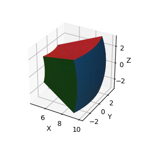
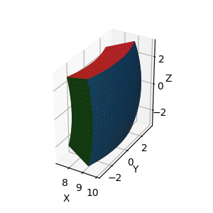
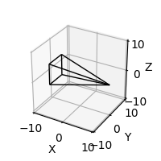
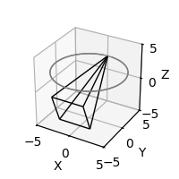
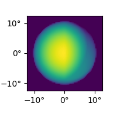
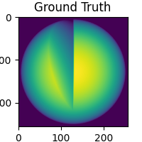
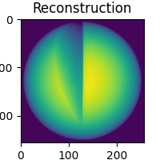
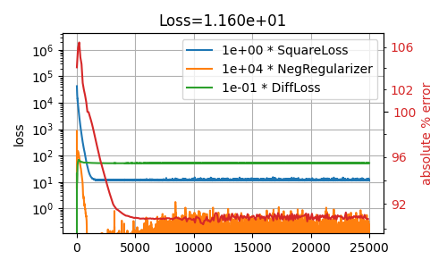
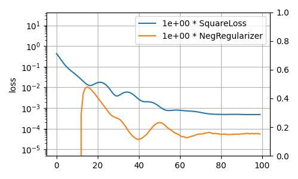

# Tutorial

This tutorial will walk through the process of setting up a tomography problem and performing a simple static reconstruction.  See the [`examples/`](https://github.com/evidlo/tomosphero/tree/master/examples) directory if you want complete working scripts.

The tutorial consists of four parts:

1. Construct a spherical grid that defines the object domain
2. Construct view geometry which defines measurement LOS
3. Combine grid and view geometry into an operator and take measurements
4. Reconstruct object with iterative algorithm

Let's get started! 🮲🮳

## Constructing Spherical Grids

The grid defines the physical extent and shape of the object to be raytraced or reconstructed.  There are several ways to instantiate grids with the `SphericalGrid` class in TomoSphero:

By shape and size.  e.g. for a spherical grid with 30 bins in radius/elevation/azimuth and outer radius of 1 (arbitrary) length units.

``` python
from tomosphero import SphericalGrid

grid = SphericalGrid(
    # voxels (radius, elevation, azimuth)
    shape=(30, 30, 30), 
    size_r=(0, 1),  # inner/outer grid radius
    # size_e=(0, 2*pi), # (radians, default) 
    # size_a=(-pi, pi), # (radians, default)
)
grid.plot()
```


Grids do not need to cover the full extent of a sphere.  Below is an example of a grid defined over a small spherical wedge.
This can be useful for reconstructions on a local region of a planetary atmosphere.

``` python
from numpy import pi
from tomosphero import SphericalGrid

grid = SphericalGrid(
    # voxels (radius, elevation, azimuth)
    shape=(10, 10, 10), 
    size_r=(3, 10),  # inner/outer grid radius
    size_e=(0.4 * pi, 0.6 * pi), # (radians)
    size_a=(-.1 * pi,  .1 * pi), # (radians) 
)
grid.plot()
```



Alternatively, grids may be specified by defining the specific location of boundaries in radius/elevation/azimuth dimensions.

``` python
from numpy import pi
from tomosphero import SphericalGrid

grid = SphericalGrid(
    r_b=[8, 9, 10],
    e_b=[0.4*pi, 0.5*pi, 0.6*pi],
    a_b=[-0.1*pi, 0.0*pi, 0.1*pi],
)
grid.plot()
```




Grid shapes may be queried later with `grid.shape` and `grid.size`.  See `tomosphero.grid.SphericalGrid`.

## Constructing View Geometries

A view geometry defines the lines of sight associated with each pixel in a sensor.  TomoSphero currently has 4 built-in view geometry types (contributions welcome):

- `tomosphero.geometry.ConeRectGeom` - Conventional rectangular camera sensor
  - lines of sight converge to single point at detector location
- `tomosphero.geometry.ParallelGeom` - Parallel lines of sight. Common geometry for medical imaging
- `tomosphero.geometry.ConeCircGeom` - Exotic circular virtual camera geometry used by the [Carruthers spacecraft](https://en.wikipedia.org/wiki/Carruthers_Geocorona_Observatory)
- `tomosphero.geometry.ViewGeom` - Base class for specifying arbitrary LOS. Sensor geometry may have any dimension/shape
  

`ConeRectGeom` is a rectilinear camera sensor, the most common sensor type.  It is defined by giving sensor shape, location, orientation, and field of view:

``` python
from tomosphero import ConeRectGeom

geom = ConeRectGeom(
    shape=(64, 64), # pixels
    pos=(10, 0, 0), # sensor location
    # lookdir=(-1, 0, 0) # sensor orientation (default: towards origin)
    fov=(45, 45) # degrees
)
geom.plot()
```



View geometries may be composed by addition to produce scanning orbits (e.g. circular/helical orbits).  The result of this operation is a `tomosphero.geometry.ViewGeomCollection` object, which behaves much like a regular `ViewGeom`.

``` python
import numpy as np
from tomosphero import ConeRectGeom

geom = None
# sweep 360° around origin in orbit of radius 5
for w in np.linspace(0, 2*np.pi, 50):
    pos=(5*np.cos(w), 5*np.sin(w), 2)
    # combine geoms by addition
    geom += ConeRectGeom(
        pos=pos,
        shape=(100, 100), # pixels
        fov=(25, 25) # degrees
    )
anim = geom.plot()
```



View geometry shape may be queried later with `geom.shape`, and its internal LOS are available through `geom.ray_starts` for LOS start points and `geom.rays` for normal vectors.

## Taking Projections

The `tomosphero.raytracer.Operator` class is responsible for carrying out the raytracing operation, taking the grid and view geometry specified previously as arguments.
At instantiation, this object will compute and store the intersection coordinates of all lines of sight with all grid boundaries and may take some time depending on the sensor and grid sizes.

TomoSphero makes extensive use of PyTorch for its autograd capabilities and GPU support. TomoSphero uses the CPU by default, but the GPU may be selected with the `device` kwarg.

Let's first begin by creating an `Operator` and defining a 3D object in a PyTorch tensor.
For simplicity, let's take our object to be a sphere with a wedge missing from it:

``` python
import torch as t
from tomosphero import Operator

# compute LOS intersections over grid
op = Operator(grid, geom, device='cuda')
# example phantom object - broken torus
x = t.zeros(grid.shape, device='cuda')
# sideways pacman object 
x[:, :, 3:] = 1
```

After instantiation, the operator accepts PyTorch arrays with shape `grid.shape` (and with appropriate `device`) and returns raytraced measurements.

``` python
# raytrace and get measurements
y = op(x)
# y.shape matches geom.shape

# plot measurements
from tomosphero.plotting import image_stack
anim = image_stack(y, geom)
```



## Reconstruction

TomoSphero is designed to be used as a component in [iterative tomographic reconstruction](https://en.wikipedia.org/wiki/Iterative_reconstruction) and provides some basic building blocks for setting up an inverse problem.  Given the synthetically generated measurement $y$ from the last section, we can use this iterative approach to fit a reconstruction $\\hat{x}$ to our measurements $y$.

Compared to more conventional techniques such as [filtered back-projection](https://en.wikipedia.org/wiki/Radon_transform#Reconstruction_approaches), [(S)ART-based methods](https://en.wikipedia.org/wiki/Algebraic_reconstruction_technique), an iterative reconstruction approach built on an autograd framework has many benefits:

- Works with any view geometry
  - Filtered back-projection techniques are generally limited to circular or helical orbits
- Availability of different optimizers
  - Any [PyTorch optimizer](https://docs.pytorch.org/docs/stable/optim.html#algorithms) may be used interchangeably in TomoSphero.  Some optimizers may handle certain problems better than others when it comes to e.g. nonconvexity.
- Rapid testing of different cost functions and regularizers
  - (S)ART-based methods are hard coded to a specific loss function
  - Iterative autograd techniques can work with any differentiable loss/regularizers

We begin by instantiating a tensor with `requires_grad=True` so PyTorch will track its gradients and set up the optimizer:

``` python
x_hat = t.zeros(grid.shape, device='cuda', requires_grad=True)
optim = t.optim.Adam([x_hat], lr=1e-1)
```

We will use a very basic least-squares loss function with no model parameterization or regularizers for our reconstruction:

$$\\hat{x} = \\arg \\min_{x} ||y - F x||_2^2$$

where $y$ are measurements, $\\hat{x}$ is the reconstructed object, and $F$ is the tomographic operator.

``` python
import matplotlib.pyplot as plt
from tomosphero.plotting import preview3d, image_stack

for i in range(100):
    optim.zero_grad()
    # compute loss and its gradient
    loss = t.sum((y - op(x_hat))**2)
    loss.backward()
    optim.step()
    
anim = image_stack(preview3d(x))
plt.title('Ground Truth')
anim = image_stack(preview3d(x_hat))
plt.title('Reconstruction')
```




We have successfully reconstructed the object!  Of course, we had ideal measurement conditions with good angular coverage and no noise, but these cases can be handled by the introduction of more sophisticated models and regularization.

As mentioned above, one of the major benefits of autograd frameworks is the flexibility to change any part of the loss function or model with minimal changes to the code.  [Model-based retrievals](#retrieval-framework) provides more details on TomoSphero's tools that make experimenting with parametric models and regularizers easier.

# Miscellaneous

## Retrieval Framework

TomoSphero provides an optional object-oriented framework for conveniently experimenting with new loss functions and tracking loss history in iterative retrieval.  The image below shows an example of a plot created with the loss tracking tools for a problem with three loss terms:



Below is an example snippet which uses the retrieval framework to implement the following minimization problem:

$$\\hat{x} = \\arg \\min_{x} \\lambda_1 \\cdot ||y - F x||_2^2 + \\lambda_2 \\cdot ||\\text{clip}_{[-\\infty, 0]}(x)||_1$$

$$\\lambda_1, \\lambda_2 = 1$$

``` python
from tomosphero.model import FullyDenseModel
from tomosphero.retrieval import gd
from tomosphero.loss import SquareLoss, NegRegularizer

# ----- Retrieval -----
# choose a parametric model for retrieval.
# FullyDenseModel is the most basic and simply has 1 parameter per voxel
# see model.py for how to define your own parametric models
m = FullyDenseModel(grid)

# choose loss functions and regularizers with weights
# see loss.py for how to define your own loss/regularization
loss_fns = [1 * SquareLoss(), 1 * NegRegularizer()]

coeffs, _, losses = gd(op, y, m, lr=1e-1, loss_fns=loss_fns, num_iterations=100)
x_hat = m(coeffs)

from tomosphero.plotting import loss_plot
loss_plot(losses)
```



## Plotting Utilities

TomoSphero features extensive plotting capabilities with many objects containing a built-in `.plot()` function for preview.  In addition, TomoSphero has a `tomosphero.plotting` module with several more plotting utilities:

- `tomosphero.plotting.image_stack` - animate a 3D stack of 2D images
- `tomosphero.plotting.color_negative` - convert grayscale positive/negative images to red/green RGB images
- `tomosphero.plotting.preview3d` - generate rotating preview of an object and grid